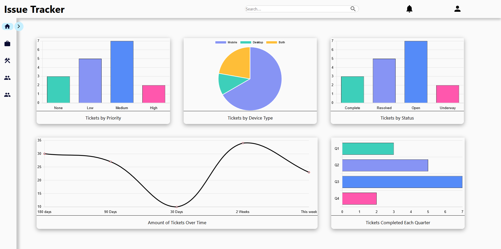

# ProjectFlow

This is a project management web application with full CRUD functionality and user authentication. Express was used to create the REST API and PostgreSQL was used for the database. Projects can be created, assigned a team of developers, assigned tickets, or deleted. 
Every ticket is assigned a developer; however, there is a live comment section on each ticket, if other team members have any input on that particular feature/task.

